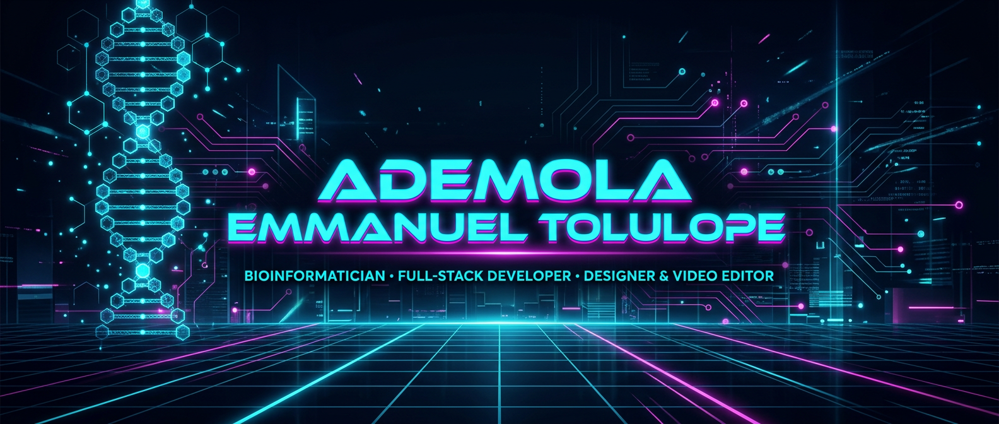

<div align="center">



[](https://git.io/typing-svg)

[](https://www.linkedin.com/in/emmanuel-ademola-428796330)
[](https://elixhub.hellofigwebsite.com/)
[](mailto:ademmanlincoln07@gmail.com)


</div>


```bash
$ whoami
> computational biologist with a designer's eye and an engineer's hands
$ mission --current
> turning biological complexity into decision engines, interfaces, and visuals
  that people can actually use — science you can click.
$ location --status
> Lagos, Nigeria 🇳🇬  |  studio: Elijah Digitals  |  open_to: research · internships · freelance
```


### ⚡ FEATURED DEPLOYMENTS

<table>
<tr>
<td width="50%" valign="top">

#### 🧬 TETRA-SHIELD AI
AMR-aware bioremediation decision intelligence — validated docking, explainable scoring, fully offline-capable web engine.

`Python` `FastAPI` `RDKit` `Docking` · [**launch →**](https://github.com/AdemolaTolulope/tetra-shield-ai)

</td>
<td width="50%" valign="top">

#### 🛰️ BIOWATCH AI
Research-grade biological surveillance — open-data connectors, anomaly detection, epistemic-honest visualization.

`Python` `Epidemiology` `Data eng` · [**launch →**](https://github.com/AdemolaTolulope/biowatch-ai)

</td>
</tr>
<tr>
<td width="50%" valign="top">

#### 💊 CYP INHIBITION PROFILER
16-model ML ensemble for CYP450 inhibition & DDI risk — cyberpunk interactive UI. OpenADMET challenge build.

`XGBoost` `Cheminformatics` `ML` · [**launch →**](https://github.com/AdemolaTolulope/cyp-inhibition-profiler)

</td>
<td width="50%" valign="top">

#### 🌿 GPR41/43 ETHNOBOTANICAL SCREEN
In-silico screening of ethnobotanical compounds against metabolite-sensing GPCRs — traditional medicine × structural bioinformatics.

`Docking` `GPCR` `Natural products` · [**launch →**](https://github.com/AdemolaTolulope/gpr41-gpr43-ethnobotanical-screening)

</td>
</tr>
</table>


### 🛠️ ARSENAL

<div align="center">

**⟨ programming & data ⟩**


**⟨ design & motion — elijah digitals ⟩**


</div>


### 📡 LIVE TELEMETRY

<div align="center">


</div>

> *activity-graph & trophy widgets temporarily parked — their public hosts went offline ecosystem-wide (paused deployments). Stats, streak, languages, typing animation & counters above run on live hosts.*


### 🧭 CURRENT HEADING

- 🔬 **Bioinformatics** — computational pipelines for One-Health problems (AMR, drug metabolism, natural products)
- 💻 **Engineering** — offline-first scientific web apps: evidence first, zero black boxes
- 🎨 **Elijah Digitals** — brand identity, UI/UX concepts, motion graphics & media production
- 🤝 **Open channel** — research collaborations · internships · freelance (bio / web / media)


### 📬 UPLINK

<div align="center">

| CHANNEL | COORDINATES |
|---|---|
| 💼 LinkedIn | [linkedin.com/in/emmanuel-ademola-428796330](https://www.linkedin.com/in/emmanuel-ademola-428796330) |
| 🌐 Portfolio | [elixhub.hellofigwebsite.com](https://elixhub.hellofigwebsite.com/) |
| 📧 Email | [ademmanlincoln07@gmail.com](mailto:ademmanlincoln07@gmail.com) |
| 🏢 Studio | **Elijah Digitals** — digital creator |

</div>

<div align="center">

**`> "Merging Science, Code, and Creativity."_`**


</div>
